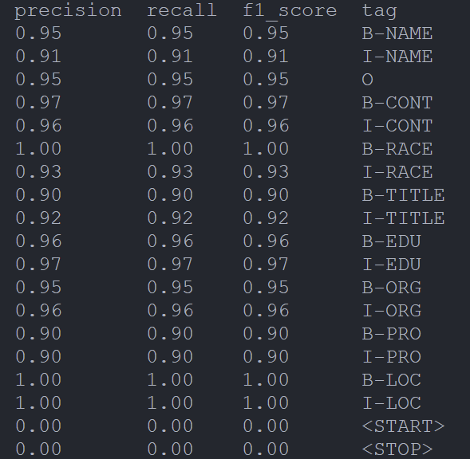

# BiLSTM-CRF
Useful for English NER  or Chinese NER work
Based on [pytorch-bilstm-crf](https://github.com/pytorch/tutorials/blob/main/beginner_source/nlp/advanced_tutorial.py)

## Result

## Todo
1. This work is finished quickly so do the minimum work based on pytorch-bilstm-crf, following its batch_size = 1  !!! So the training stage is so slow.... 1 epoch == 15 mins in 3080 Ti
